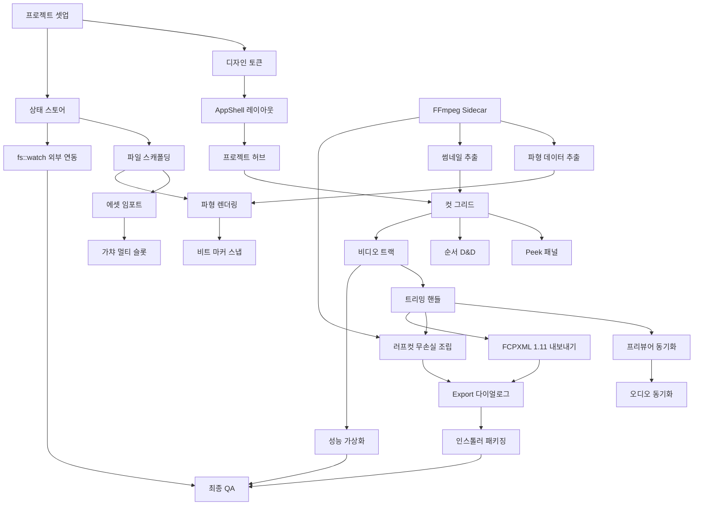

# StoryFrame Studio Next — 개발 계획서 (Development Roadmap)

- **문서 버전:** v2.0-FINAL
- **작성 일자:** 2026-10-04
- **참조 문서:** PRD.md
- **구현 스택:** Tauri 2.x (Rust) · React 19 · TypeScript 5.x · Tailwind CSS 4 (OKLCH) · shadcn/ui · Framer Motion · Lucide Icons

---

## 1. 개발 원칙 & 전략

### 1.1 기술 스택 확정

| 기술 | 버전/스펙 | 선정 이유 |
| :--- | :--- | :--- |
| **Tauri** | 2.x | 네이티브 수준의 성능, 로컬 파일 시스템의 완벽한 접근 권한, 매우 작은 번들 사이즈, 강력한 Rust 백엔드 통합. |
| **React** | 19 | Concurrent rendering과 Suspense를 활용한 매끄러운 UI. (로컬 앱이므로 Server Components는 미사용) |
| **TypeScript** | 5.x | 엄격한 타입 안전성을 통한 런타임 에러 방지 및 뛰어난 개발자 경험(DX). |
| **Tailwind CSS** | 4 | OKLCH 색상 공간 네이티브 지원으로 풍부한 색상 표현, JIT 컴파일러 기반의 빠른 빌드. |
| **shadcn/ui** | Latest | 컴포넌트 소유권 100% 확보, Radix UI 기반의 뛰어난 접근성과 유연한 커스터마이징. |
| **Zustand + Immer** | Latest | 가벼운 보일러플레이트, 불변성 유지를 위한 구조적 공유로 복잡한 프로젝트 상태 관리에 최적. |
| **Framer Motion** | Latest | 스프링 물리 엔진 기반의 자연스럽고 유려한 애니메이션 적용. |
| **Lucide Icons** | Latest | 1.5px 선 두께의 일관된 미니멀리즘 디자인으로 세련된 UI 구성. |
| **FFmpeg** | Sidecar | 미디어 처리, 썸네일 추출, 비디오 무손실 조립을 위한 독립적 바이너리(Sidecar) 실행. |

### 1.2 개발 워크플로우

- **브랜치 전략:** GitHub Flow 기반 (main 브랜치는 항상 배포 가능한 상태 유지, 기능별 `feature/기능명` 브랜치 분기).
- **PR 규칙:** 모든 PR은 1명 이상의 리뷰어 승인이 필요하며, CI 파이프라인(빌드 및 린트) 통과 필수.
- **커밋 컨벤션:** Conventional Commits 준수 (`feat:`, `fix:`, `chore:`, `refactor:`, `docs:`).

### 1.3 테스트 전략

- **단위 테스트:** Vitest (프론트엔드 비즈니스 로직 및 스토어 검증), `cargo test` (Rust 커맨드 로직).
- **통합 테스트:** React Testing Library (컴포넌트 상호작용 검증).
- **E2E 테스트:** Playwright (Tauri 기반 데스크톱 앱 플로우 테스트).

### 1.4 디렉토리 구조

```
src/
├── assets/         # 폰트, 정적 이미지 등
├── components/     # UI 컴포넌트 (shadcn, 공통, 도메인별)
├── hooks/          # 커스텀 훅
├── lib/            # 유틸리티 (motion.ts, tailwind 유틸 등)
├── store/          # Zustand 스토어 정의
├── types/          # TypeScript 타입 정의 (project.ts 등)
├── views/          # 페이지/레이아웃 뷰 (AppShell, Hub, Editor 등)
└── App.tsx         # 최상위 컴포넌트
```

---

## 2. Phase 1 — 코어 셸 & 상태 엔진 (Week 1~2)

**목표:** Tauri 앱이 빌드되고, AppShell 레이아웃이 렌더링되며, project_state.json의 CRUD가 동작하는 최소 실행 가능 셸 구축.

#### P1-01: Tauri 2.x + React 19 + Tailwind 4 프로젝트 부트스트랩
- [x] `pnpm create tauri-app` 실행 및 React 19 + TypeScript + Vite 환경 구성
- [x] Tailwind CSS 4 설치 및 OKLCH 지원 여부 확인
- [x] shadcn/ui 초기화 (`components.json` 설정 및 `cn` 유틸리티 추가)
- [x] Lucide Icons 패키지 설치
- [x] Framer Motion 패키지 설치
- [x] ESLint + Prettier 설정 (TS 및 React 룰 적용)
- [x] tsconfig.json strict 모드 활성화 및 paths alias (`@/` -> `src/`) 설정
- [x] 로컬 개발 서버 및 프로덕션 빌드 성공 여부 확인
- **산출물:** 초기화된 프로젝트 레포지토리 및 동작하는 데브 서버.
- **검증 기준:** `pnpm tauri dev` 명령어로 앱이 성공적으로 실행되며 화면에 기본 앱 셸이 표시되어야 함.
- **예상 소요:** 2일

#### P1-02: 디자인 토큰 시스템
- [x] `tailwind.config.ts` 작성 (PRD §4 색상 체계 전체 반영)
- [x] CSS 변수 정의 (`globals.css` 내 컬러 헥스 및 OKLCH 값 맵핑)
- [x] 타이포그래피 스케일 정의 (Inter, Pretendard, JetBrains Mono 폰트 로드 및 맵핑)
- [x] `sfMotion` 프리셋 객체 작성 (`src/lib/motion.ts` 내 스프링 애니메이션 프리셋)
- [x] 테마 프리뷰 페이지 작성 (개발 모드 전용 `/dev/tokens` 라우트 구성)
- **산출물:** 디자인 토큰이 적용된 스타일시트 및 유틸리티 파일.
- **검증 기준:** 테마 프리뷰 페이지에서 정의된 모든 색상, 폰트, 모션 프리셋이 정상적으로 표시됨.
- **예상 소요:** 3일

#### P1-03: AppShell 레이아웃
- [x] TitleBar 컴포넌트 구현 (`data-tauri-drag-region` 적용, 최소화/최대화/닫기 버튼 연동)
- [x] CollapsibleSidebar 구현 (Framer Motion을 이용해 48px ↔ 260px 토글 애니메이션 적용)
- [x] MainContent 영역 구현 (수직 2분할 레이아웃 및 PanelResizer를 통한 크기 조절 기능)
- [x] StatusBar 구현 (현재 프로젝트명, 글로벌 진행률, FFmpeg 백그라운드 작업 상태 표시)
- [x] 반응형 레이아웃 리사이징 테스트 및 보완
- **산출물:** 앱의 뼈대가 되는 AppShell React 컴포넌트 세트.
- **검증 기준:** 사이드바 축소/확대가 부드럽게 작동하고 타이틀바를 통해 창 이동 및 리사이즈가 정상 동작함.
- **예상 소요:** 4일

#### P1-04: Zustand 스토어 + project_state.json CRUD
- [x] Zustand 및 Immer 미들웨어 설치 및 기본 설정
- [x] `StoryFrameStore` 인터페이스 및 타입 정의
- [x] `loadProject`, `saveProject` 비동기 액션 구현 (Tauri FS API 활용)
- [x] `useAutoSave` 커스텀 훅 구현 (상태 변경 감지 시 500ms debounced 자동 저장)
- [x] `useExternalSync` 커스텀 훅 구현 (Rust `fs::watch` 이벤트 리스너 연동하여 외부 변경 시 스토어 갱신)
- [x] TypeScript 타입 파일 작성 (`src/types/project.ts`)
- **산출물:** 프로젝트 상태를 관리하는 전역 스토어 및 동기화 로직.
- **검증 기준:** 상태 변경 시 500ms 후 디스크에 저장되며, 외부에서 파일 수정 시 UI가 업데이트 됨.
- **예상 소요:** 4일

#### P1-05: 프로젝트 폴더 스캐폴딩 Tauri 커맨드
- [x] `create_project` 커맨드 (Rust: 새 폴더 생성 및 기본 구조 초기화)
- [x] `open_project` 커맨드 (Rust: 폴더 선택 다이얼로그 및 메타데이터 읽기)
- [x] `save_project_state` 커맨드 (Rust: JSON 파일 쓰기)
- [x] `list_recent_projects` 커맨드 (Rust: 최근 열어본 프로젝트 목록 반환)
- [x] 앱 전역 설정 파일 `.storyframe/config.json` 관리 로직 초기화
- [x] 최근 프로젝트 기록 `.storyframe/recent_projects.json` 업데이트 로직
- **산출물:** 파일 시스템 작업을 처리하는 Rust 커맨드 모듈.
- **검증 기준:** 클라이언트에서 Rust 커맨드 호출 시 권한 문제 없이 파일 입출력이 정확히 수행됨.
- **예상 소요:** 3일

### Phase 1 마일스톤 체크리스트
- [ ] `pnpm tauri dev`로 앱 실행 시 AppShell이 렌더링됨
- [ ] 사이드바 토글 애니메이션 작동
- [ ] 빈 프로젝트 생성 → 폴더 구조 확인
- [ ] project_state.json 로드/저장 확인
- [ ] 자동 저장 500ms 디바운스 확인

---

## 3. Phase 2 — 프로젝트 허브 & 컷 그리드 (Week 3~5)

**목표:** 프로젝트 허브에서 프로젝트를 선택하고, 컷 카드 그리드에서 컷을 관리하며, Peek 패널로 상세 편집이 가능한 상태 구현.

#### P2-01: ProjectHubPage + ProjectCard
- [x] 최근 프로젝트 목록을 보여주는 ProjectHubPage 레이아웃 구현
- [x] 개별 프로젝트 정보를 표시하는 ProjectCard 컴포넌트 구현
- [x] 새 프로젝트 생성 버튼 및 플로우 연결
- **산출물:** 앱 진입 시 나타나는 홈 화면.
- **검증 기준:** 최근 프로젝트 목록이 올바르게 표시되고 클릭 시 해당 프로젝트 뷰로 이동함.
- **예상 소요:** 3일

#### P2-02: CutGridView + CutCard (벤토 그리드)
- [x] 컷 목록을 벤토 스타일 그리드로 렌더링하는 CutGridView 구현
- [x] 각 컷의 상태와 썸네일을 표시하는 CutCard 컴포넌트 구현
- [x] 뷰 모드 전환 (그리드 뷰 ↔ 리스트 뷰)
- **산출물:** 씬 내 컷들을 시각적으로 관리하는 메인 뷰.
- **검증 기준:** 다수의 컷 카드가 그리드 형태에 맞게 정렬되고 반응형 리사이징에 대응함.
- **예상 소요:** 4일

#### P2-03: PeekPanel (PeekCutDetail)
- [x] CutCard 클릭 시 우측에서 슬라이드 인 되는 PeekPanel 구현
- [x] 선택된 컷의 상세 정보(대사, 노트, 메타데이터)를 표시 및 편집하는 폼 연결
- [x] Framer Motion을 활용한 부드러운 패널 전환 애니메이션
- **산출물:** 컷 상세 편집기 사이드 패널.
- **검증 기준:** 패널 내에서 데이터를 수정하면 상태가 스토어에 즉시 반영되고 저장됨.
- **예상 소요:** 3일

#### P2-04: 에셋 드래그 앤 드롭 임포트
- [x] CutCard 및 앱 영역에 파일 드롭 존 구현
- [x] Tauri API를 이용한 외부 파일 드롭 이벤트 감지
- [x] 드롭된 미디어 파일을 프로젝트 assets 폴더로 복사 및 상태 업데이트
- **산출물:** 미디어 파일 임포트 시스템.
- **검증 기준:** 비디오/오디오 파일을 드롭하면 앱 내 복사 작업이 진행되고 화면에 반영됨.
- **예상 소요:** 4일

#### P2-05: 가챠 멀티 슬롯 (BentoVideoSlots)
- [x] CutCard 내 여러 버전의 비디오/에셋을 관리하는 슬롯 UI 구현
- [x] 슬롯 간 활성화된 버전 스위칭 기능
- **산출물:** 여러 생성 결과를 비교할 수 있는 벤토 스타일 슬롯 컴포넌트.
- **검증 기준:** 슬롯 클릭 시 활성 비디오가 교체되며 스토어에 선택 상태가 업데이트 됨.
- **예상 소요:** 3일

#### P2-06: 모션 난이도 뱃지 (BentoMotionBadge)
- [x] 컷의 애니메이션 난이도/상태를 나타내는 뱃지 UI 컴포넌트 구현
- [x] 뱃지 색상 및 아이콘 매핑 (OKLCH 컬러 시스템 연동)
- **산출물:** 모션 복잡도를 시각적으로 나타내는 인디케이터.
- **검증 기준:** 설정된 난이도에 따라 올바른 색상과 아이콘이 렌더링됨.
- **예상 소요:** 1일

#### P2-07: 컷 순서 드래그 앤 드롭 재배치
- [x] dnd-kit 또는 유사 라이브러리를 활용하여 CutGridView 내 드래그 앤 드롭 구현
- [x] 순서 변경 완료 시 Zustand 스토어 배열 재정렬 및 자동 저장
- **산출물:** 직관적인 컷 순서 변경 인터페이스.
- **검증 기준:** 카드 드래그 시 고스트 이미지가 보이고, 드롭 시 배열 순서가 즉시 업데이트됨.
- **예상 소요:** 3일

#### P2-08: 컨텍스트 메뉴 (우클릭)
- [x] 컷 카드 및 빈 공간 우클릭 시 나타나는 컨텍스트 메뉴 구현
- [x] 복제, 삭제, 상태 변경 등 빠른 액션 메뉴 연동
- **산출물:** 사용자 정의 우클릭 팝업 메뉴.
- **검증 기준:** 우클릭 메뉴 액션이 정확히 스토어 상태 변경 함수를 호출함.
- **예상 소요:** 2일

### Phase 2 마일스톤 체크리스트
- [ ] 프로젝트 허브에서 새 프로젝트 생성 및 열기 가능
- [ ] 컷 그리드에 데이터가 렌더링되고 편집 패널로 정보 수정 가능
- [ ] 비디오 파일 드래그 앤 드롭 임포트 작동
- [ ] 컷 순서 드래그로 변경 시 상태 동기화 확인

---

## 4. Phase 3 — 타임라인 & 가편집 엔진 (Week 5~8)

**목표:** 음악 파형과 비트 마커가 표시되는 타임라인에서 클립을 배열하고, In/Out 트리밍, 순서 스왑, 버전 교체가 가능한 실시간 가편집 워크벤치 구축.

#### P3-01: WaveformTrack (Canvas 파형 렌더링)
- [x] 오디오 파일 데이터를 읽어 Peak 배열 생성 로직 구현
- [x] HTML5 Canvas를 이용해 파형을 고성능으로 렌더링
- [x] 줌/팬에 따른 파형 리렌더링 최적화
- **산출물:** 오디오 파형이 시각화되는 타임라인 트랙 컴포넌트.
- **검증 기준:** 오디오 파일을 로드하면 정확한 파형이 딜레이 없이 렌더링됨.
- **예상 소요:** 4일

#### P3-02: BeatMarker 표시 + Beat Magnet Snap (±50ms 확정)
- [x] 음악의 비트 정보를 파싱하여 타임라인 위에 마커 오버레이 표시
- [x] 클립 이동 및 트리밍 시 비트 마커 근처 (±50ms 확정)에서 자석처럼 스냅되는 로직 구현
- **산출물:** 리듬 기반 편집을 돕는 스냅 및 마커 시스템.
- **검증 기준:** 클립을 드래그하여 비트 마커 50ms 이내 접근 시 마커 위치로 틱(snap) 달라붙음.
- **예상 소요:** 4일

#### P3-03: VideoTrack + TimelineClip
- [x] 비디오 클립들이 배치되는 메인 트랙 컴포넌트 구현
- [x] 개별 클립 렌더링 (썸네일, 클립 이름, 길이 표시)
- **산출물:** 타임라인 비디오 트랙 인터페이스.
- **검증 기준:** 프로젝트 상태에 정의된 컷들이 타임라인에 정확한 시간 비율로 나열됨.
- **예상 소요:** 3일

#### P3-04: In/Out 트리밍 핸들
- [x] TimelineClip 좌우 끝에 드래그 가능한 트리밍 핸들 추가
- [x] 트리밍 시 비디오 소스의 시작/끝 시간(In/Out 포인터) 상태 업데이트
- **산출물:** 클립 길이 조절 인터페이스.
- **검증 기준:** 핸들 드래그 시 클립의 활성 구간이 실시간으로 변경되고 재생 시 반영됨.
- **예상 소요:** 4일

#### P3-05: 클립 드래그 앤 드롭 순서 재배치
- [x] 타임라인 상에서 클립 간 드래그로 위치를 맞바꾸거나 삽입하는 로직 구현
- [x] 스왑 애니메이션 및 상태 동기화 처리
- **산출물:** 타임라인 내 클립 리오더링 기능.
- **검증 기준:** 클립 드롭 시 주변 클립들이 밀려나거나 순서가 변경되며 빈 공간 없이 스냅됨.
- **예상 소요:** 3일

#### P3-06: 클립 내 버전 드롭다운 교체
- [x] 타임라인 클립 우클릭 혹은 버튼 클릭 시 가챠 슬롯에 있는 다른 버전 선택 메뉴 노출
- [x] 버전 변경 시 썸네일 및 미디어 소스 즉시 교체
- **산출물:** 인라인 버전 스위처.
- **검증 기준:** 버전 교체 시 타임라인 상의 클립 정보가 즉각적으로 새로운 에셋으로 갱신됨.
- **예상 소요:** 2일

#### P3-07: PreviewPlayer (대형 비디오 프리뷰어 + Playhead)
- [x] 타임라인의 현재 Playhead 위치에 맞춰 비디오 프레임을 동기화하는 플레이어 뷰어 구현
- [x] Playhead 드래그 스크러빙에 따른 실시간 프레임 탐색
- **산출물:** 실시간 프리뷰 뷰어 컴포넌트.
- **검증 기준:** 타임라인 재생 시 뷰어의 영상과 오디오가 싱크에 맞게 재생됨.
- **예상 소요:** 5일

#### P3-08: 키보드 단축키 시스템
- [x] 전역 키보드 이벤트 리스너 훅 작성
- [x] 재생/정지 (Space), In/Out 지정 (I, O), J/K/L 셔틀, 배율 조절 (1-9), 클립 이동 ([, ]), 저장 (Ctrl+S), 내보내기 (Ctrl+E) 매핑
- **산출물:** 키보드 중심 워크플로우를 위한 단축키 매니저.
- **검증 기준:** 명시된 모든 단축키가 포커스 상태와 무관하게(입력 필드 제외) 정확히 동작함.
- **예상 소요:** 3일

#### P3-09: 음악 트랙 오디오 재생 동기화
- [x] HTML5 Audio 또는 Web Audio API를 활용한 기준 오디오 재생기 구현
- [x] 비디오 플레이어들과 마스터 오디오 클락 동기화 로직
- **산출물:** 통합 오디오/비디오 동기화 재생 시스템.
- **검증 기준:** 장시간 재생 시에도 오디오와 비디오 간의 싱크 오차가 발생하지 않음.
- **예상 소요:** 4일

### Phase 3 마일스톤 체크리스트
- [ ] 오디오 파형이 캔버스에 정상 렌더링됨
- [ ] 비트 마커 기준 ±50ms 스냅 작동 확인
- [ ] 타임라인 트리밍 및 순서 변경 시 스토어 반영 확인
- [ ] 스페이스바 재생 시 프리뷰 플레이어 동기화 확인

---

## 5. Phase 4 — FFmpeg 통합 & 내보내기 (Week 8~11)

**목표:** FFmpeg sidecar를 활용한 미디어 처리 파이프라인 구축 및 러프컷 조립, FCPXML 1.11 내보내기 기능 완성.

#### P4-01: FFmpeg sidecar 번들링 & Rust 래퍼
- [x] Tauri 설정에 FFmpeg 및 FFprobe 바이너리를 sidecar로 포함 구성
- [x] Rust 측에서 `std::process::Command`를 통해 FFmpeg를 호출하는 비동기 래퍼 작성
- **산출물:** 앱 내장 FFmpeg 실행 환경.
- **검증 기준:** 바이너리 경로를 성공적으로 찾고 `--version` 커맨드 결과를 반환함.
- **예상 소요:** 3일

#### P4-02: 파형 데이터 추출 (`generate_waveform`)
- [x] FFmpeg를 사용하여 오디오 파일에서 JSON 형태의 peak 데이터를 추출하는 Rust 커맨드 작성
- [x] 클라이언트에서 호출 후 결과를 스토어 캐시에 저장
- **산출물:** 파형 데이터 제네레이터.
- **검증 기준:** 무거운 오디오 파일도 백그라운드에서 처리되어 UI 블로킹 없이 파형 데이터가 로드됨.
- **예상 소요:** 2일

#### P4-03: 썸네일 자동 생성 (`generate_thumbnail`)
- [x] 비디오 임포트 시 첫 프레임 혹은 지정된 시간의 프레임을 추출하여 썸네일(JPEG/WebP)로 저장하는 로직
- **산출물:** 썸네일 제네레이터.
- **검증 기준:** 비디오 추가 즉시 지정된 폴더에 썸네일 이미지가 생성됨.
- **예상 소요:** 2일

#### P4-04: 마지막 프레임 추출 & 체이닝 (`extract_last_frame`)
- [x] 모션 생성 시 연속성을 위해 이전 컷의 마지막 프레임을 추출하는 Rust 커맨드 구현
- [x] 추출된 이미지를 다음 컷의 참조 에셋으로 연결
- **산출물:** 프레임 추출 유틸리티.
- **검증 기준:** 트리밍된 Out 포인트의 정확한 프레임 이미지가 추출되어 저장됨.
- **예상 소요:** 2일

#### P4-05: 러프컷 무손실 조립 (`assemble_roughcut`)
- [x] 타임라인에 배치된 클립들의 정보를 바탕으로 FFmpeg concat demuxer용 텍스트 파일 생성
- [x] 재인코딩 없이(copy 코덱) 비디오를 하나로 합치는 병합 명령어 실행
- **산출물:** 빠른 러프컷 렌더러.
- **검증 기준:** 타임라인 순서대로 병합된 mp4 파일이 지정된 경로에 무손실로 매우 빠르게 생성됨.
- **예상 소요:** 4일

#### P4-06: 렌더링 진행률 이벤트 (`render_progress`)
- [x] FFmpeg 출력 스트림을 파싱하여 진행률(%) 계산
- [x] Tauri Event를 통해 프론트엔드로 진행률 이벤트 발송 및 UI 진행바 업데이트
- **산출물:** 실시간 렌더링 프로그레스 바.
- **검증 기준:** 내보내기 진행 중 상태바에 퍼센트가 정확히 올라감.
- **예상 소요:** 3일

#### P4-07: FCPXML 1.11 내보내기 (우선 구현)
- [x] 컷 타임라인 데이터를 FCPXML 1.11 스펙에 맞는 XML 구조로 매핑
- [x] 초 단위를 rational time(예: 30000/1001s) 포맷으로 변환 로직 적용
- [x] `<asset>` 리소스 선언 및 `<spine>` 내 `<asset-clip>` 시퀀스 구성
- [x] 음악 트랙을 connected clip 요소로 삽입
- [x] Final Cut Pro에서 임포트 테스트 및 포맷 유효성 검증 (FCPXML 1.11 우선 지원)
- **산출물:** 파이널컷 프로 호환 XML 익스포터.
- **검증 기준:** 생성된 fcpxml 파일을 Final Cut Pro에서 열었을 때 모든 클립과 컷편집 포인트가 유지됨.
- **예상 소요:** 5일

#### P4-08: CapCut `draft_content.json` 내보내기
- [x] CapCut 데스크톱 포맷 분석 및 JSON 스키마 매핑
- [x] 로컬 CapCut 프로젝트 폴더 구조로 파일 복사 및 프로젝트 세팅 생성
- **산출물:** CapCut 호환 프로젝트 익스포터.
- **검증 기준:** CapCut에서 프로젝트 열기 시 타임라인이 복원됨.
- **예상 소요:** 4일

#### P4-09: Export 다이얼로그 UI
- [x] 내보내기 옵션(러프컷 비디오, FCPXML, CapCut)을 선택하는 모달 다이얼로그
- [x] 저장 경로 지정 및 성공/실패 결과 피드백 뷰 구현
- **산출물:** 내보내기 UI 플로우.
- **검증 기준:** 옵션 선택 후 프로세스 시작, 진행, 완료 알림까지 원활하게 이어짐.
- **예상 소요:** 2일

### Phase 4 마일스톤 체크리스트
- [ ] FFmpeg sidecar 백그라운드 실행 확인
- [ ] 파형 추출 및 썸네일 생성 테스트 통과
- [ ] 러프컷 무손실 조립(.mp4) 산출물 확인
- [ ] FCPXML 1.11 파일 생성 및 Final Cut Pro 임포트 성공

---

## 6. Phase 5 — 폴리싱, 연동 & 배포 (Week 11~14)

**목표:** Antigravity 에이전트 연동, 디테일한 모션 폴리싱, 성능 최적화 완료 후 최종 릴리즈 패키징.

#### P5-01: `fs::watch` 외부 변경 감지 (Antigravity ↔ UI 실시간 동기화)
- [x] 백그라운드의 AI 에이전트(Antigravity)가 `project_state.json`을 수정할 때 UI에 지연 없이 반영되도록 디바운싱 처리
- [x] 핫 리로드 시 유실되는 사용자 입력이 없도록 상태 병합(Merge) 로직 정교화
- **산출물:** 견고한 양방향 상태 동기화 파이프라인.
- **검증 기준:** 외부 프로세스가 JSON을 수정하면 1초 이내에 앱 UI가 깜빡임 없이 갱신됨.
- **예상 소요:** 4일

#### P5-02: 사이드바 콘텐츠 (시놉시스, 캐릭터 DNA, 무드보드)
- [x] 스토어 상태를 바탕으로 좌측 사이드바에 프로젝트 메타데이터(시놉시스, 캐릭터 정보) 렌더링
- [x] 무드보드 이미지 썸네일 그리드 컴포넌트 추가
- **산출물:** 풍부한 프로젝트 정보 사이드바.
- **검증 기준:** 각 탭 클릭 시 해당 정보 뷰로 자연스럽게 전환됨.
- **예상 소요:** 3일

#### P5-03: Framer Motion 모션 전체 적용
- [x] 화면 전환, 모달 팝업, 호버 이펙트 등 전반에 `sfMotion` 스프링 프리셋 적용
- [x] 애니메이션 프레임 드롭 확인 및 불필요한 레이아웃 스래싱 최적화
- **산출물:** 유려한 사용자 경험을 제공하는 모션 시스템.
- **검증 기준:** 앱 내 모든 인터랙션이 60fps로 매끄럽게 동작함.
- **예상 소요:** 4일

#### P5-04: 접근성 감사 & 키보드 네비게이션
- [x] shadcn/ui 기반 컴포넌트의 ARIA 라벨 및 포커스 링 확인
- [x] 탭(Tab) 키 네비게이션 플로우 점검 및 수정
- **산출물:** 접근성이 확보된 애플리케이션.
- **검증 기준:** 마우스 없이 키보드만으로 주요 프로젝트 편집 및 내보내기가 가능함.
- **예상 소요:** 2일

#### P5-05: 성능 프로파일링 & 최적화
- [x] 수백 개의 컷이 있을 때 타임라인 렌더링 병목 해소를 위한 가상화(Virtualization) 적용
- [x] 캔버스 파형 렌더링 시 Web Worker 오프로딩 검토 및 적용
- [x] 상태 스토어 분리 검토로 불필요한 리렌더 방지
- **산출물:** 성능 최적화 리포트 및 패치.
- **검증 기준:** 긴 타임라인에서도 패닝/줌이 끊김 없이 부드럽게 작동함.
- **예상 소요:** 5일

#### P5-06: 에러 핸들링 & 사용자 알림 시스템
- [x] 파일 누락, 인코딩 에러, JSON 파싱 실패 등에 대한 글로벌 에러 바운더리 구축
- [x] Toast 컴포넌트를 이용한 비침입형 사용자 알림 큐 시스템 연동
- **산출물:** 안정성 높은 에러 관리 인터페이스.
- **검증 기준:** 예기치 않은 오류 발생 시 앱이 크래시되지 않고 적절한 복구 방법과 함께 토스트 메시지가 표시됨.
- **예상 소요:** 2일

#### P5-07: 인스톨러 패키징 (.msi / .exe / .dmg)
- [x] Tauri tauri.conf.json 빌드 옵션 최종 점검
- [x] Windows용 MSI/EXE, macOS용 DMG 빌드 스크립트 작성 및 아이콘(.ico, .icns) 적용
- **산출물:** 배포 가능한 설치 파일 패키지.
- **검증 기준:** 각 OS 환경에서 설치 후 앱이 정상 구동됨.
- **예상 소요:** 3일

#### P5-08: README.md & 사용자 가이드 문서
- [x] 설치 방법, 단축키 목록, 폴더 구조 설명이 포함된 문서 작성
- **산출물:** 최종 사용자 가이드 문서.
- **검증 기준:** 문서를 보고 3rd-party 사용자가 앱을 활용할 수 있음.
- **예상 소요:** 2일

#### P5-09: 최종 QA 체크리스트
- [x] 전 구간 E2E 테스트 시나리오 수행
- [x] 메모리 누수 점검 (Long running test)
- **산출물:** 릴리즈 승인 리포트.
- **검증 기준:** 중대 결함(Blocker, Critical) Zero 상태 달성.
- **예상 소요:** 4일

### Phase 5 마일스톤 체크리스트
- [ ] 외부 프로세스의 JSON 수정이 UI에 실시간 반영됨
- [ ] 모든 애니메이션 최적화 및 60fps 방어 확인
- [ ] 프로덕션 빌드(MSI/DMG) 생성 및 설치 확인
- [ ] 중대 버그 0건 확인 후 v2.0 릴리즈 승인

---

## 7. 종합 타임라인 (주차별 진행표)

| Week | 주차별 주요 마일스톤 | Phase |
| :--- | :--- | :--- |
| **Week 1** | 프로젝트 셋업, 디자인 토큰, AppShell 레이아웃 | Phase 1 |
| **Week 2** | Zustand 상태 스토어, 프로젝트 CRUD, Tauri 커맨드 | Phase 1 |
| **Week 3** | 프로젝트 허브 뷰, 컷 그리드 기본 구조 | Phase 2 |
| **Week 4** | 드래그 앤 드롭 임포트, Peek 패널 UI | Phase 2 |
| **Week 5** | 컷 오더링 로직, 타임라인 파형 렌더링 시작 | Phase 2 & 3 |
| **Week 6** | 비트 마커 스냅, 타임라인 비디오 트랙 | Phase 3 |
| **Week 7** | 트리밍 핸들, 프리뷰어 플레이어 동기화 | Phase 3 |
| **Week 8** | 단축키, FFmpeg sidecar 번들링 | Phase 3 & 4 |
| **Week 9** | 파형 추출, 썸네일, 프레임 체이닝 로직 | Phase 4 |
| **Week 10** | 무손실 조립 렌더링, Export 다이얼로그 | Phase 4 |
| **Week 11** | FCPXML 1.11 내보내기, 외부 변경 감지 연동 | Phase 4 & 5 |
| **Week 12** | 모션 최적화, 사이드바 콘텐츠 완성 | Phase 5 |
| **Week 13** | 가상화 등 성능 최적화, 접근성 감사 | Phase 5 |
| **Week 14** | 패키징 빌드, QA 수정 및 문서화 마감 | Phase 5 |

---

## 8. 의존성 그래프



---

## 9. 위험 요소 & 완화 전략

| 위험 요소 | 영향도 | 발생 확률 | 완화 전략 |
| :--- | :--- | :--- | :--- |
| **FFmpeg 타겟 OS 호환성 문제** <br> (특히 macOS 보안 제한) | 높음 | 보통 | Tauri 빌드 옵션에서 바이너리 서명 및 권한(entitlements) 사전 구성 테스트. 필요시 WASM 기반으로 fallback. |
| **수백 개 클립 렌더링 시 DOM 성능 저하** | 높음 | 높음 | Phase 5에서 `@tanstack/react-virtual` 등 가상화 기법을 도입하여 화면에 보이는 요소만 렌더링 하도록 초기 설계 반영. |
| **Antigravity 에이전트와의 충돌 (Race condition)** | 높음 | 보통 | `fs::watch` 수신 시 내부 변경 사항과 외부 변경 사항을 비교 병합하는 영리한 Merge 전략 및 디바운스 적용. |
| **동기화 불일치 (오디오/비디오 싱크 엇나감)** | 중간 | 중간 | Web Audio API를 마스터 클락으로 사용하고, 비디오 프리뷰어는 이 클락에 슬레이브로 동작하도록 단방향 싱크 설계. |
| **FCPXML 포맷 호환성 이슈** | 중간 | 높음 | 명세가 엄격하므로 Final Cut Pro 최신 버전에서 생성된 XML을 베이스라인으로 역설계 분석; 최소한의 필수 속성 위주로 구성. |

---
문서 끝
