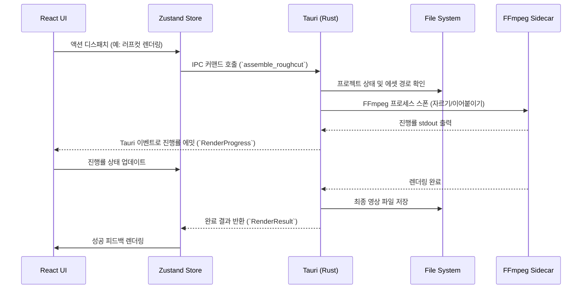
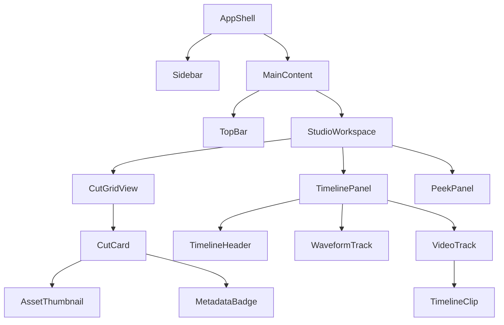
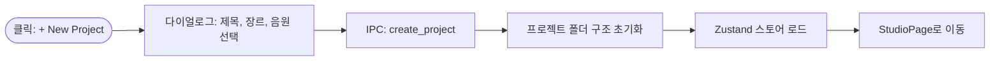
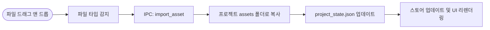
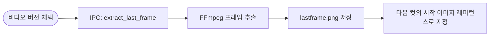
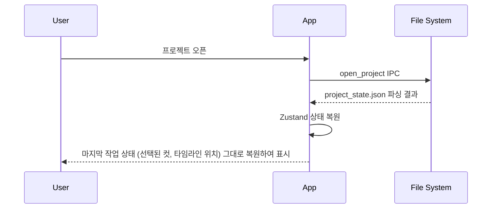
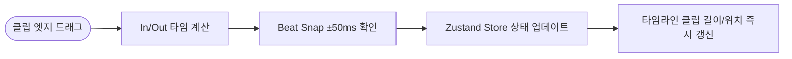
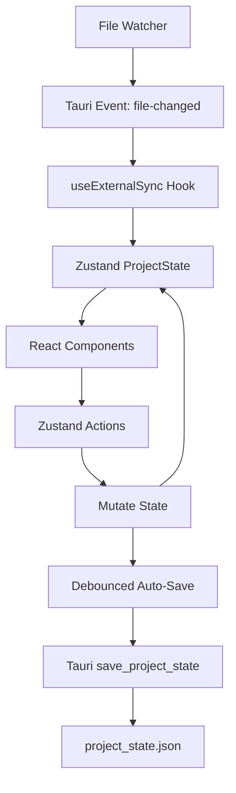

# StoryFrame Studio Next - Product Requirements Document (PRD)

**문서 버전:** v2.0-FINAL  
**작성 일자:** 2026-10-04  
**구현 스택:** Frontend (React, TypeScript, Tailwind CSS, Framer Motion, Zustand) / Backend (Tauri, Rust, FFmpeg)

---

## 1. 아키텍처 오버뷰

### 1.1 시스템 블록 다이어그램

```mermaid
flowchart TD
    subgraph Frontend [Frontend (React / TypeScript)]
        UI[UI Components]
        Store[Zustand Store]
        Hooks[Custom Hooks]
        UI <--> Store
        UI <--> Hooks
    end

    subgraph Backend [Backend (Tauri / Rust)]
        Cmd[Tauri Commands]
        Event[Tauri Events]
        FFmpegWrapper[FFmpeg Wrapper]
        FileWatcher[File Watcher]
    end

    subgraph FileSystem [Local File System]
        ProjectJSON[project_state.json]
        Assets[Assets & Media]
        Output[Render Output]
    end

    Hooks <-->|IPC Commands| Cmd
    Event -->|IPC Events| Hooks
    Cmd <--> FFmpegWrapper
    Cmd <--> FileSystem
    FileWatcher -->|Detect Changes| Event
    FFmpegWrapper --> Output
    FFmpegWrapper --> Assets
```

### 1.2 핵심 아키텍처 원칙

| 원칙 | 설명 |
|---|---|
| 서버리스 로컬 (Serverless Local) | 클라우드 백엔드 없이 모든 데이터와 미디어를 로컬 파일 시스템에서 직접 처리합니다. |
| API-Free GUI | 외부 API에 의존하지 않는 독립적인 GUI 애플리케이션으로 동작합니다. |
| State Machine | 상태를 예측 가능한 상태 머신(Zustand)으로 관리하며 단방향 데이터 흐름을 유지합니다. |
| FFmpeg Sidecar | 미디어 처리(파형 추출, 렌더링, 썸네일 등)는 백그라운드의 FFmpeg 프로세스에 위임합니다. |
| File-Watch Sync | 외부 앱(예: 탐색기)에서 파일이 변경되면 즉시 감지하여 UI 상태를 동기화합니다. |

### 1.3 데이터 플로우 시퀀스



---

## 2. 데이터 모델 & JSON 스키마

### 2.1 project_state.json 전체 스키마

```jsonc
{
  "$schema": "storyframe://project_state.v1",
  "version": "1.0.0",
  "meta": {
    "id": "uuid-v4", // 프로젝트 고유 ID
    "title": "Night Goes On", // 프로젝트 제목
    "genre": "Lo-Fi Jazz MV", // 프로젝트 장르/테마
    "createdAt": "2026-10-01T14:30:00+09:00", // 생성 일시
    "updatedAt": "2026-10-04T22:15:00+09:00", // 최근 수정 일시
    "synopsis": "새벽 2시, 빈 재즈바에서...", // 간단한 시놉시스
    "targetDurationSec": 75.0, // 목표 영상 길이 (초)
    "thumbnailPath": "assets/thumbnail.webp" // 프로젝트 대표 썸네일 경로
  },
  "progress": {
    "phase": "video_generation", // 현재 메인 작업 단계
    "totalCuts": 24, // 총 컷 수
    "completedCuts": 18, // 작업 완료된 컷 수
    "pendingTasks": [ // 대기 중인 작업 목록
      { "cutId": "cut-19", "task": "video_generation", "note": "댄스 모션 재시도 필요" },
      { "cutId": "cut-22", "task": "illustration", "note": "배경 무드 미확정" }
    ]
  },
  "music": {
    "filePath": "assets/audio/night_goes_on_master.mp3", // 원본 오디오 경로
    "durationSec": 75.0, // 오디오 총 길이 (초)
    "bpm": 82, // 곡의 BPM
    "waveformCachePath": "cache/waveform.json", // 파형 데이터 캐시 경로
    "beatMarkers": [ // 비트 마커 목록 (스냅용)
      { "timeSec": 0.0, "type": "kick" },
      { "timeSec": 0.731, "type": "snare" },
      { "timeSec": 1.463, "type": "kick" }
    ],
    "sections": [ // 곡의 주요 섹션 (가사 등)
      { "id": "section-1", "label": "Intro", "startSec": 0.0, "endSec": 8.5, "lyrics": "" },
      { "id": "section-2", "label": "Verse 1", "startSec": 8.5, "endSec": 24.0, "lyrics": "밤이 깊어갈수록 재즈바는 비어가고..." }
    ]
  },
  "globalAssets": {
    "characterSheets": [ // 캐릭터 설정 시트
      {
        "id": "char-01",
        "name": "주인공 (재즈 피아니스트)",
        "frontRefPath": "assets/characters/char01_front.png",
        "sideRefPath": "assets/characters/char01_side.png",
        "styleNotes": "30대 남성, 검은 터틀넥, 슬림 체형"
      }
    ],
    "moodboards": [ // 무드보드 설정
      {
        "id": "mood-01",
        "label": "재즈바 인테리어",
        "imagePaths": ["assets/moodboard/jazzbar_01.jpg", "assets/moodboard/jazzbar_02.jpg"],
        "notes": "어두운 앰버 조명, 빈티지 우드 인테리어"
      }
    ]
  },
  "cuts": [ // 개별 컷 데이터 목록
    {
      "id": "cut-01", // 컷 고유 ID
      "index": 1, // 순번
      "sectionId": "section-1", // 속한 음악 섹션 ID
      "story": { // 스토리보드 데이터
        "description": "빈 재즈바 전경. 연기 자욱한 공기 사이로 무대 스팟 조명만 비춤.",
        "lyrics": "",
        "timeRange": { "startSec": 0.0, "endSec": 3.0 }
      },
      "illustration": { // 일러스트레이션 에셋 데이터
        "status": "approved",
        "primaryImagePath": "assets/cuts/cut01/I01_start.png",
        "variantPaths": [],
        "characterRefs": ["char-01"],
        "moodboardRefs": ["mood-01"],
        "camera": { "angle": "Wide Shot", "movement": "Slow Zoom In", "notes": "" }
      },
      "video": { // 비디오 에셋 데이터
        "status": "selected",
        "motionDifficulty": "safe",
        "motionDescription": "정적 장면 + 느린 줌인. 연기 파티클만 움직임.",
        "versions": [ // 생성된 비디오 버전 목록
          {
            "versionId": "v1",
            "filePath": "assets/cuts/cut01/V01_v1.mp4",
            "durationSec": 5.0,
            "generatedBy": "Kling v2.1",
            "generatedAt": "2026-10-03T10:00:00+09:00",
            "isSelected": true,
            "thumbnailPath": "assets/cuts/cut01/V01_v1_thumb.webp",
            "notes": "줌 속도 적절. 채택."
          },
          {
            "versionId": "v2",
            "filePath": "assets/cuts/cut01/V01_v2.mp4",
            "durationSec": 5.0,
            "generatedBy": "Kling v2.1",
            "generatedAt": "2026-10-03T10:15:00+09:00",
            "isSelected": false,
            "thumbnailPath": "assets/cuts/cut01/V01_v2_thumb.webp",
            "notes": "줌 너무 빠름. 보류."
          }
        ],
        "lastFramePath": "assets/cuts/cut01/V01_v1_lastframe.png" // 끝 프레임 (체이닝용)
      },
      "timeline": { // 타임라인 클립 정보
        "inPointSec": 0.2, // 비디오 파일 내 시작점
        "outPointSec": 3.0, // 비디오 파일 내 끝점
        "effectiveDurationSec": 2.8, // 실제 사용 길이
        "absoluteStartSec": 0.0, // 전체 프로젝트 타임라인 상의 시작점
        "transitionIn": "cut", // 시작 트랜지션
        "transitionOut": "cut" // 끝 트랜지션
      }
    }
  ],
  "roughCut": { // 러프컷 렌더링 상태
    "lastAssembledAt": "2026-10-04T21:30:00+09:00",
    "outputPath": "output/roughcut_latest.mp4",
    "totalDurationSec": 68.4,
    "cutOrder": ["cut-01", "cut-02", "cut-03"] // 조립 순서 배열
  },
  "uiState": { // UI 전역 상태 보존
    "selectedCutId": "cut-05",
    "sidebarCollapsed": false,
    "timelineZoom": 1.0,
    "gridColumns": 4
  }
}
```

### 2.2 TypeScript 타입 정의

```typescript
export type ProjectPhase = "storyboard" | "illustration" | "video_generation" | "rough_cut" | "export_ready";
export type AssetStatus = "empty" | "draft" | "approved";
export type VideoStatus = "empty" | "generating" | "review" | "selected";
export type MotionDifficulty = "safe" | "caution" | "danger";
export type TransitionType = "cut" | "crossfade_500ms";
export type BeatType = "kick" | "snare" | "hihat" | "accent";

export interface ProjectMeta {
  id: string;
  title: string;
  genre: string;
  createdAt: string;
  updatedAt: string;
  synopsis: string;
  targetDurationSec: number;
  thumbnailPath: string;
}

export interface PendingTask {
  cutId: string;
  task: ProjectPhase;
  note: string;
}

export interface Progress {
  phase: ProjectPhase;
  totalCuts: number;
  completedCuts: number;
  pendingTasks: PendingTask[];
}

export interface BeatMarker {
  timeSec: number;
  type: BeatType;
}

export interface MusicSection {
  id: string;
  label: string;
  startSec: number;
  endSec: number;
  lyrics: string;
}

export interface MusicTrack {
  filePath: string;
  durationSec: number;
  bpm: number;
  waveformCachePath: string;
  beatMarkers: BeatMarker[];
  sections: MusicSection[];
}

export interface CharacterSheet {
  id: string;
  name: string;
  frontRefPath: string;
  sideRefPath: string;
  styleNotes: string;
}

export interface Moodboard {
  id: string;
  label: string;
  imagePaths: string[];
  notes: string;
}

export interface GlobalAssets {
  characterSheets: CharacterSheet[];
  moodboards: Moodboard[];
}

export interface CameraInfo {
  angle: string;
  movement: string;
  notes: string;
}

export interface CutIllustration {
  status: AssetStatus;
  primaryImagePath: string;
  variantPaths: string[];
  characterRefs: string[];
  moodboardRefs: string[];
  camera: CameraInfo;
}

export interface VideoVersion {
  versionId: string;
  filePath: string;
  durationSec: number;
  generatedBy: string;
  generatedAt: string;
  isSelected: boolean;
  thumbnailPath: string;
  notes: string;
}

export interface CutVideo {
  status: VideoStatus;
  motionDifficulty: MotionDifficulty;
  motionDescription: string;
  versions: VideoVersion[];
  lastFramePath: string;
}

export interface TimeRange {
  startSec: number;
  endSec: number;
}

export interface CutStory {
  description: string;
  lyrics: string;
  timeRange: TimeRange;
}

export interface CutTimeline {
  inPointSec: number;
  outPointSec: number;
  effectiveDurationSec: number;
  absoluteStartSec: number;
  transitionIn: TransitionType;
  transitionOut: TransitionType;
}

export interface Cut {
  id: string;
  index: number;
  sectionId: string;
  story: CutStory;
  illustration: CutIllustration;
  video: CutVideo;
  timeline: CutTimeline;
}

export interface RoughCut {
  lastAssembledAt: string;
  outputPath: string;
  totalDurationSec: number;
  cutOrder: string[];
}

export interface UIState {
  selectedCutId: string | null;
  sidebarCollapsed: boolean;
  timelineZoom: number;
  gridColumns: number;
}

export interface ProjectState {
  version: string;
  meta: ProjectMeta;
  progress: Progress;
  music: MusicTrack;
  globalAssets: GlobalAssets;
  cuts: Cut[];
  roughCut: RoughCut;
  uiState: UIState;
}
```

---

## 3. 디렉토리 & 파일 컨벤션

### 3.1 전역 워크스페이스 구조

```text
C:\Users\Username\Documents\StoryFrame_Projects
├── My_First_MV\              # 개별 프로젝트 폴더 1
├── Jazz_Night\               # 개별 프로젝트 폴더 2
└── workspace_prefs.json      # 전역 워크스페이스 설정 파일
```

### 3.2 개별 프로젝트 폴더 구조

```text
Jazz_Night/
├── project_state.json         # 메인 상태 파일 (진실의 원천)
├── assets/
│   ├── audio/                 # BGM, 음향효과 파일 저장
│   │   └── night_goes_on_master.mp3
│   ├── characters/            # 캐릭터 시트 및 레퍼런스
│   ├── moodboard/             # 무드보드 이미지
│   ├── thumbnail.webp         # 프로젝트 썸네일
│   └── cuts/                  # 각 컷별 에셋 폴더 (자동 생성)
│       ├── cut01/
│       │   ├── I01_start.png
│       │   ├── V01_v1.mp4
│       │   ├── V01_v1_thumb.webp
│       │   └── V01_v1_lastframe.png
│       └── cut02/
├── cache/                     # 임시 생성 파일 (파형 데이터 등)
│   └── waveform.json
└── output/                    # 렌더링 결과물 (러프컷, FCPXML, CapCut 등)
    ├── roughcut_latest.mp4
    ├── export.fcpxml
    └── capcut_draft/
```

### 3.3 파일 명명 규칙

| 에셋 유형 | 명명 규칙 포맷 | 예시 | 비고 |
|---|---|---|---|
| 컷 폴더 | `cut{index:02d}` | `cut01/`, `cut15/` | 2자리 패딩 |
| 컷 일러스트 | `I{index:02d}_{variant}.png` | `I01_start.png` | 원본 일러스트 |
| 비디오 버전 | `V{index:02d}_{versionId}.mp4` | `V01_v1.mp4` | 각 버전별 분리 |
| 썸네일 | `V{index:02d}_{versionId}_thumb.webp` | `V01_v1_thumb.webp` | WebP 포맷 사용 |
| 끝 프레임 | `V{index:02d}_{versionId}_lastframe.png`| `V01_v1_lastframe.png` | 다음 컷 체이닝용 |

---

## 4. 디자인 시스템

### 4.1 색상 체계 (OKLCH Dark-First)

**Surface Elevation (7단계)**

| 변수명 | 색상 (OKLCH) | HEX | 용도 |
|---|---|---|---|
| `--color-canvas` | `oklch(0.05 0.005 270)` | `#010102` | 앱 최하단 배경 |
| `--color-surface-0` | `oklch(0.10 0.005 270)` | `#0c0d10` | 베이스 패널 배경 |
| `--color-surface-1` | `oklch(0.14 0.005 270)` | `#141518` | 카드, 사이드바 배경 |
| `--color-surface-2` | `oklch(0.18 0.008 270)` | `#1c1d22` | 호버 상태 카드, 팝오버 |
| `--color-surface-3` | `oklch(0.22 0.008 270)` | `#25262c` | 선택된 요소, 입력 필드 |
| `--color-border` | `oklch(0.25 0.005 270)` | `#2c2d33` | 기본 테두리 |
| `--color-border-subtle` | `oklch(0.18 0.005 270)` | `#1c1d22` | 약한 테두리 (구분선) |

**Text (3단계)**

| 변수명 | 색상 (OKLCH) | HEX | 용도 |
|---|---|---|---|
| `--color-text-primary` | `oklch(0.93 0.005 270)` | `#e8e9ec` | 기본 텍스트, 제목 |
| `--color-text-secondary`| `oklch(0.65 0.005 270)` | `#8b8d95` | 보조 텍스트, 설명 |
| `--color-text-tertiary` | `oklch(0.45 0.005 270)` | `#5a5c64` | 비활성 텍스트, 플레이스홀더 |

**Accent & Semantic (5종)**

| 변수명 | 색상 (OKLCH) | HEX | 용도 |
|---|---|---|---|
| `--color-accent` | `oklch(0.65 0.20 250)` | `#4488ff` | 프라이머리 액션, 포커스 |
| `--color-accent-muted` | `oklch(0.65 0.20 250 / 0.15)` | `#4488ff26`| 액센트 배경 (투명도) |
| `--color-safe` | `oklch(0.70 0.18 145)` | `#34d399` | 성공, 승인, 안전 |
| `--color-caution` | `oklch(0.75 0.18 85)` | `#fbbf24` | 경고, 대기중, 보류 |
| `--color-danger` | `oklch(0.65 0.22 25)` | `#f87171` | 에러, 위험, 삭제 |

### 4.2 Tailwind CSS 설정

```typescript
// tailwind.config.ts
import type { Config } from 'tailwindcss'

const config: Config = {
  content: [
    './src/pages/**/*.{js,ts,jsx,tsx,mdx}',
    './src/components/**/*.{js,ts,jsx,tsx,mdx}',
    './src/app/**/*.{js,ts,jsx,tsx,mdx}',
  ],
  theme: {
    extend: {
      colors: {
        canvas: 'var(--color-canvas)',
        surface: {
          0: 'var(--color-surface-0)',
          1: 'var(--color-surface-1)',
          2: 'var(--color-surface-2)',
          3: 'var(--color-surface-3)',
        },
        border: {
          DEFAULT: 'var(--color-border)',
          subtle: 'var(--color-border-subtle)',
        },
        text: {
          primary: 'var(--color-text-primary)',
          secondary: 'var(--color-text-secondary)',
          tertiary: 'var(--color-text-tertiary)',
        },
        accent: {
          DEFAULT: 'var(--color-accent)',
          muted: 'var(--color-accent-muted)',
        },
        safe: 'var(--color-safe)',
        caution: 'var(--color-caution)',
        danger: 'var(--color-danger)',
      },
      fontFamily: {
        sans: ['Inter', 'Pretendard', 'sans-serif'],
        mono: ['JetBrains Mono', 'monospace'],
      },
    },
  },
  plugins: [],
}
export default config
```

### 4.3 타이포그래피

| 수준 | 폰트 크기 | 굵기 | 행간 | 용도 |
|---|---|---|---|---|
| H1 | 24px | 700 | 1.2 | 화면 제목 |
| H2 | 20px | 600 | 1.3 | 패널 제목 |
| H3 | 16px | 600 | 1.4 | 카드 제목 |
| Body | 14px | 400 | 1.5 | 본문 내용 |
| Caption | 12px | 400 | 1.4 | 메타데이터, 보조 설명 |
| Mono | 12px | 400 | 1.5 | 코드, 시간(Timecode) 표시 |

### 4.4 아이콘
모든 아이콘은 `Lucide Icons`를 사용하여 일관된 두께(Stroke Width 2px)와 둥근 모서리 스타일을 적용합니다.

### 4.5 모션 프리셋 (Framer Motion)

```typescript
// utils/motion.ts
import { Variants } from "framer-motion";

export const sfMotion = {
  fadeIn: {
    initial: { opacity: 0 },
    animate: { opacity: 1 },
    exit: { opacity: 0 },
    transition: { duration: 0.2, ease: "easeInOut" }
  } as Variants,
  
  slideUp: {
    initial: { opacity: 0, y: 10 },
    animate: { opacity: 1, y: 0 },
    exit: { opacity: 0, y: 10 },
    transition: { type: "spring", stiffness: 300, damping: 25 }
  } as Variants,

  pop: {
    initial: { scale: 0.95, opacity: 0 },
    animate: { scale: 1, opacity: 1 },
    exit: { scale: 0.95, opacity: 0 },
    transition: { type: "spring", stiffness: 400, damping: 20 }
  } as Variants
};
```

---

## 5. 컴포넌트 아키텍처

### 5.1 컴포넌트 트리 계층도



### 5.2 핵심 컴포넌트 상세 명세

#### AppShell 레이아웃
```text
+---------------------------------------------------------+
| [Sidebar] | [TopBar] (Project Title, Export, Global Act)|
| (Icon     |---------------------------------------------|
|  Nav)     |                                             |
|           |                 StudioWorkspace             |
|           |                                             |
+---------------------------------------------------------+
```
- **Props**: `children: ReactNode`, `collapsed: boolean`
- **동작**: 좌측 네비게이션과 상단 툴바를 고정하고 중앙에 작업 영역 렌더링.

#### CutCard 벤토 그리드
```text
+-----------------------+
| 01. Intro Scene  [Status]|
|-----------------------|
|                       |
|   [ Image/Video ]     |
|   [  Thumbnail  ]     |
|                       |
|-----------------------|
| Time: 0:00 - 0:03     |
| [Sync Audio/Lyrics]   |
+-----------------------+
```
- **인터랙션**: 클릭 시 `PeekPanel`에서 상세 정보 오픈. 드래그 앤 드롭으로 순서 변경 지원. Hover 시 `Border` 색상 변경(`surface-2`).

#### TimelineClip
```text
[ |> Cut 01 (2.8s)   | ]
```
- **인터랙션**: 양끝 핸들 드래그로 In/Out Point 조절. 드래그 앤 드롭 시 `Beat Magnet Snap` 동작.

---

## 6. 화면별 상세 스펙

### 6.1 Screen 01: ProjectHubPage

```text
+---------------------------------------------------+
| Recent Projects                          [+ New]  |
|                                                   |
| +-------------+ +-------------+ +-------------+   |
| | [Thumbnail] | | [Thumbnail] | | [Thumbnail] |   |
| | Night Goes  | | Jazz Bar    | | MV Draft    |   |
| | Last Edit.. | | Last Edit.. | | Last Edit.. |   |
| +-------------+ +-------------+ +-------------+   |
+---------------------------------------------------+
```
- **데이터소스**: `list_recent_projects()` IPC 반환 데이터
- **인터랙션**: 카드 클릭 시 해당 프로젝트 로드 (Screen 02 진입)

### 6.2 Screen 02: StudioPage

2단 분리형 스튜디오 인터페이스를 제공합니다.

#### 6.2.1 상단: CutGridView
- **레이아웃**: 반응형 Grid (기본 4열, 단축키로 확대/축소)
- **정렬/섹션 구분**: `sectionId` 기준으로 그룹화하여 구분선 렌더링.
- **빈 슬롯**: 컷과 컷 사이 빈 공간을 클릭하여 새 컷 삽입 가능.

#### 6.2.2 하단: TimelinePanel

```text
+---------------------------------------------------+
| 0:00        0:01        0:02        0:03        0:04
| ------------------------------------------------- |
| [=== Waveform ===|==== Waveform ===|==========]   |
|   ^ (Kick)          ^ (Snare)                     |
| ------------------------------------------------- |
| [ || Cut 01 || ]  [ || Cut 02 || ]                |
+---------------------------------------------------+
```

- **WaveformTrack**: `music.waveformCachePath`를 파싱하여 Canvas API로 오디오 파형 렌더링.
- **Beat Magnet Snap 알고리즘 확정**:
  - 클립을 드래그하거나 길이를 조절할 때 비트 마커 근처에 접근하면 자석처럼 달라붙음.
  - 임계값: **±50ms 확정**

```typescript
// utils/snap.ts
const SNAP_THRESHOLD_SEC = 0.05; // ±50ms 이내 자석 흡착

export function snapToNearestBeat(timeSec: number, beatMarkers: BeatMarker[]): number {
  let nearest = timeSec;
  let minDist = Infinity;
  for (const marker of beatMarkers) {
    const dist = Math.abs(timeSec - marker.timeSec);
    if (dist < minDist && dist <= SNAP_THRESHOLD_SEC) {
      minDist = dist;
      nearest = marker.timeSec;
    }
  }
  return nearest;
}
```

### 6.3 Screen 03: PeekPanel

```text
+-----------------------------+
| X (Close)                   |
| 컷 01 상세 설정               |
|-----------------------------|
| [일러스트레이션 에셋 영역]     |
| (메인 이미지, 바리에이션)     |
|                             |
| [비디오 에셋 영역]           |
| (버전 선택, 모션 설명)        |
|                             |
| [스토리 및 메타데이터 영역]    |
| (가사, 카메라, 메모)          |
+-----------------------------+
```

```typescript
export interface PeekPanelProps {
  cutId: string;
  isOpen: boolean;
  onClose: () => void;
  cutData: Cut;
}
```

---

## 7. 인터랙션 플로우

### 7.1 Flow A: 새 프로젝트 생성



### 7.2 Flow B: 에셋 임포트



### 7.3 Flow C: 끝 프레임 체이닝



### 7.4 Flow D: 러프컷 어셈블

```mermaid
flowchart LR
    ClickRender([Render RoughCut 클릭]) --> Cmd[IPC: assemble_roughcut]
    Cmd --> WriteList[FFmpeg concat용 txt 파일 생성]
    WriteList --> Exec[FFmpeg 실행]
    Exec --> Progress[UI 진행률 표시 (Event)]
    Progress --> Done[완료 및 mp4 출력]
    Done --> Play[비디오 플레이어로 리뷰]
```

### 7.5 Flow E: 세션 교체 & 상태 복원



### 7.6 Flow F: 타임라인 실시간 가편집



### 7.7 키보드 단축키 맵

| 단축키 | 액션 | 컨텍스트 |
|---|---|---|
| `Space` | 타임라인 재생 / 일시정지 | 전역 |
| `Cmd/Ctrl + S` | 수동 저장 (기본은 자동저장됨) | 전역 |
| `+ / -` | 타임라인 확대 / 축소 | 타임라인 포커스 시 |
| `Cmd/Ctrl + Z` | 실행 취소 (Undo) | 전역 |
| `Cmd/Ctrl + Shift + Z` | 다시 실행 (Redo) | 전역 |
| `[ / ]` | CutGrid 열 개수 증감 | CutGridView 포커스 시 |
| `Esc` | PeekPanel 닫기, 팝업 닫기 | 전역 |

---

## 8. Tauri 백엔드(Rust) 커맨드 인터페이스

### 8.1 IPC 커맨드 정의

```rust
// 프로젝트 생명주기
#[tauri::command] 
/// 새 프로젝트를 생성하고 기본 구조를 초기화합니다.
async fn create_project(title: String, genre: String, music_path: String) -> Result<ProjectState, String>;

#[tauri::command] 
/// 기존 프로젝트를 열고 상태를 불러옵니다.
async fn open_project(project_path: String) -> Result<ProjectState, String>;

#[tauri::command] 
/// 프로젝트 상태를 JSON 파일로 저장합니다.
async fn save_project_state(state: ProjectState) -> Result<(), String>;

#[tauri::command] 
/// 최근 작업한 프로젝트 목록을 반환합니다.
async fn list_recent_projects() -> Result<Vec<RecentProject>, String>;

// 에셋 관리
#[tauri::command] 
/// 외부 파일을 프로젝트 에셋 폴더로 복사/가져오기 합니다.
async fn import_asset(project_path: String, cut_id: String, file_path: String, asset_type: String) -> Result<AssetImportResult, String>;

// 미디어 처리 (FFmpeg 연동)
#[tauri::command] 
/// 비디오 파일의 마지막 프레임을 추출하여 이미지로 저장합니다.
async fn extract_last_frame(video_path: String, output_path: String) -> Result<String, String>;

#[tauri::command] 
/// 오디오 파일에서 파형 데이터를 추출하여 JSON 캐시로 반환합니다.
async fn generate_waveform(audio_path: String, output_path: String) -> Result<WaveformData, String>;

#[tauri::command] 
/// 이미지/비디오 파일에서 썸네일을 생성합니다.
async fn generate_thumbnail(input_path: String, output_path: String, width: u32) -> Result<String, String>;

#[tauri::command] 
/// 여러 클립을 병합하여 하나의 러프컷 영상을 생성합니다.
async fn assemble_roughcut(project_path: String, segments: Vec<TrimSegment>) -> Result<RenderResult, String>;

#[tauri::command] 
/// 현재 진행 중인 렌더링 작업의 진행률을 조회합니다.
async fn get_render_progress() -> Result<RenderProgress, String>;

// 외부 내보내기
#[tauri::command] 
/// FCPXML 포맷으로 타임라인 데이터를 내보냅니다.
async fn export_fcpxml(project_path: String, output_path: String) -> Result<(), String>;

#[tauri::command] 
/// CapCut JSON 포맷으로 타임라인 데이터를 내보냅니다.
async fn export_capcut(project_path: String, output_path: String) -> Result<(), String>;

// 파일 시스템 감시
#[tauri::command] 
/// 지정된 프로젝트 폴더의 변경 사항을 감시합니다.
async fn watch_project_folder(project_path: String) -> Result<(), String>;

#[tauri::command] 
/// 폴더 감시를 중단합니다.
async fn stop_watching() -> Result<(), String>;
```

### 8.2 Tauri 이벤트 Backend→Frontend

```typescript
import { listen } from '@tauri-apps/api/event';

// 렌더링 진행률 이벤트 리스너
listen<RenderProgress>('render-progress', (event) => {
  const { percentage, currentTask, status } = event.payload;
  // 스토어 또는 UI 업데이트
});

// 파일 시스템 변경 감지 이벤트 리스너
listen<FileChangeEvent>('file-changed', (event) => {
  const { path, changeType } = event.payload;
  // 외부 변경 동기화 로직 실행
});
```

### 8.3 Rust 데이터 구조 (serde)

```rust
use serde::{Deserialize, Serialize};

#[derive(Serialize, Deserialize)]
pub struct TrimSegment {
    pub file_path: String,
    pub in_point_sec: f64,
    pub out_point_sec: f64,
}

#[derive(Serialize, Deserialize)]
pub struct RenderResult {
    pub output_path: String,
    pub duration_sec: f64,
}

#[derive(Serialize, Deserialize)]
pub struct RenderProgress {
    pub percentage: f32,
    pub current_task: String,
    pub status: String,
}

#[derive(Serialize, Deserialize)]
pub struct WaveformData {
    pub samples: Vec<f32>,
    pub sample_rate: u32,
}

#[derive(Serialize, Deserialize)]
pub struct FileChangeEvent {
    pub path: String,
    pub change_type: String, // "created" | "modified" | "deleted"
}
```

---

## 9. 상태 관리 & 세션 지속성

### 9.1 프론트엔드 상태 아키텍처



### 9.2 Zustand Store 설계

```typescript
// store/useStoryFrameStore.ts
import { create } from 'zustand';
import { ProjectState, Cut, UIState } from '../types';

export interface StoryFrameStore {
  project: ProjectState | null;
  setProject: (project: ProjectState) => void;
  updateCut: (cutId: string, updates: Partial<Cut>) => void;
  updateUIState: (updates: Partial<UIState>) => void;
}

export const useStoryFrameStore = create<StoryFrameStore>((set) => ({
  project: null,
  
  setProject: (project) => set({ project }),
  
  updateCut: (cutId, updates) => set((state) => {
    if (!state.project) return state;
    const newCuts = state.project.cuts.map(c => 
      c.id === cutId ? { ...c, ...updates } : c
    );
    return { project: { ...state.project, cuts: newCuts } };
  }),
  
  updateUIState: (updates) => set((state) => {
    if (!state.project) return state;
    return { project: { ...state.project, uiState: { ...state.project.uiState, ...updates } } };
  })
}));
```

### 9.3 자동 저장 Debounced Auto-Save

```typescript
// hooks/useAutoSave.ts
import { useEffect, useRef } from 'react';
import { invoke } from '@tauri-apps/api/tauri';
import { useStoryFrameStore } from '../store/useStoryFrameStore';
import debounce from 'lodash.debounce';

export function useAutoSave() {
  const project = useStoryFrameStore((state) => state.project);
  
  const debouncedSave = useRef(
    debounce(async (data) => {
      try {
        await invoke('save_project_state', { state: data });
        console.log('Project state auto-saved successfully.');
      } catch (error) {
        console.error('Failed to auto-save project:', error);
      }
    }, 1500)
  ).current;

  useEffect(() => {
    if (project) {
      debouncedSave(project);
    }
  }, [project, debouncedSave]);
}
```

### 9.4 외부 변경 감지 Antigravity↔UI 동기화

```typescript
// hooks/useExternalSync.ts
import { useEffect } from 'react';
import { listen } from '@tauri-apps/api/event';
import { invoke } from '@tauri-apps/api/tauri';
import { useStoryFrameStore } from '../store/useStoryFrameStore';

export function useExternalSync(projectPath: string) {
  const setProject = useStoryFrameStore((state) => state.setProject);

  useEffect(() => {
    const setupWatcher = async () => {
      // 프로젝트 폴더 감시 시작
      await invoke('watch_project_folder', { projectPath });
      
      const unlisten = await listen('file-changed', async (event) => {
        const { path } = event.payload as any;
        // project_state.json이 외부에서 변경되었을 경우만 동기화
        if (path.endsWith('project_state.json')) {
          try {
            const updatedState = await invoke('open_project', { projectPath });
            setProject(updatedState as any);
            console.log('Project state synced from external changes.');
          } catch (error) {
            console.error('Sync failed:', error);
          }
        }
      });

      return () => {
        unlisten();
        invoke('stop_watching');
      };
    };

    let cleanupFn: (() => void) | undefined;
    setupWatcher().then((fn) => { cleanupFn = fn; });

    return () => {
      if (cleanupFn) cleanupFn();
    };
  }, [projectPath, setProject]);
}
```

---

## 10. FFmpeg 통합 파이프라인

### 10.1 Sidecar 번들링
Tauri 셋업에서 FFmpeg 바이너리를 Sidecar 형식으로 번들링합니다.

```json
// tauri.conf.json 발췌
{
  "tauri": {
    "bundle": {
      "externalBin": ["bin/ffmpeg", "bin/ffprobe"]
    }
  }
}
```

### 10.2 핵심 FFmpeg 명령 템플릿

```bash
# 1. 오디오 파형 데이터 추출 (Rust 내부 파싱용, JSON 형태 변환 필요 시)
ffprobe -v error -show_entries format=duration -of default=noprint_wrappers=1:nokey=1 input.mp3

# 2. 마지막 프레임 추출
ffmpeg -sseof -0.1 -i input.mp4 -update 1 -q:v 2 output_lastframe.png

# 3. 썸네일 추출 (지정 시간)
ffmpeg -ss 00:00:01 -i input.mp4 -vframes 1 -q:v 2 output_thumb.webp

# 4. 무손실 러프컷 조립 (concat demuxer)
# mylist.txt 내용:
# file '/path/to/V01_v1.mp4'
# inpoint 0.2
# outpoint 3.0
# file '/path/to/V02_v1.mp4'
ffmpeg -f concat -safe 0 -i mylist.txt -c copy output_roughcut.mp4
```

### 10.3 Rust 측 FFmpeg 실행 래퍼

```rust
use std::process::Command;
use tauri::api::process::Command as TauriCommand;

/// 기본 FFmpeg 명령어 실행 래퍼
pub async fn run_ffmpeg(args: Vec<&str>) -> Result<String, String> {
    let output = TauriCommand::new_sidecar("ffmpeg")
        .map_err(|e| e.to_string())?
        .args(args)
        .output()
        .map_err(|e| e.to_string())?;

    if output.status.success() {
        Ok(output.stdout)
    } else {
        Err(output.stderr)
    }
}

/// 러프컷 조립 구현체
pub async fn assemble_roughcut_impl(project_path: &str, segments: Vec<TrimSegment>, output_path: &str) -> Result<(), String> {
    let list_path = format!("{}/cache/concat_list.txt", project_path);
    let mut list_content = String::new();

    for seg in segments {
        list_content.push_str(&format!("file '{}'\n", seg.file_path));
        list_content.push_str(&format!("inpoint {}\n", seg.in_point_sec));
        list_content.push_str(&format!("outpoint {}\n", seg.out_point_sec));
    }

    std::fs::write(&list_path, list_content).map_err(|e| e.to_string())?;

    let args = vec![
        "-y",
        "-f", "concat",
        "-safe", "0",
        "-i", &list_path,
        "-c", "copy",
        output_path
    ];

    run_ffmpeg(args).await?;
    
    Ok(())
}
```

---

## 11. Export 파이프라인 (FCPXML / CapCut)

### 11.1 FCPXML 1.11 내보내기

#### XML 템플릿
```xml
<?xml version="1.0" encoding="UTF-8"?>
<!DOCTYPE fcpxml>
<fcpxml version="1.11">
  <resources>
    <format id="r1" name="FFVideoFormat1080p2997" frameDuration="1001/30000s" width="1920" height="1080"/>
    <asset id="a1" name="V01_v1" src="file:///path/to/V01_v1.mp4" start="0s" duration="5s" hasVideo="1" hasAudio="0"/>
    <asset id="a2" name="V02_v1" src="file:///path/to/V02_v1.mp4" start="0s" duration="5s" hasVideo="1" hasAudio="0"/>
  </resources>
  <library>
    <event name="Night Goes On">
      <project name="Night Goes On - RoughCut">
        <sequence format="r1" duration="68400/10000s">
          <spine>
            <asset-clip ref="a1" offset="0s" duration="2800/1000s" start="200/1000s" name="Cut 01"/>
            <asset-clip ref="a2" offset="2800/1000s" duration="2200/1000s" start="0s" name="Cut 02"/>
          </spine>
        </sequence>
      </project>
    </event>
  </library>
</fcpxml>
```

#### Rust 생성 로직 보강 (시간 변환)
FCPXML에서는 시간을 분수(Rational Time) 형태로 표기합니다.
```rust
/// 초(seconds)를 FCPXML 호환 rational time 문자열로 변환 (예: 2.8 -> "2800/1000s")
pub fn sec_to_rational_time(sec: f64) -> String {
    let num = (sec * 1000.0).round() as i64;
    format!("{}/1000s", num)
}
```

### 11.2 CapCut draft_content.json 내보내기

```jsonc
{
  "materials": {
    "videos": [
      {
        "id": "mat-video-01",
        "path": "C:/path/to/V01_v1.mp4",
        "duration": 5000000, // 마이크로초 단위 (5초)
        "type": "video"
      }
    ]
  },
  "tracks": [
    {
      "id": "track-01",
      "type": "video",
      "segments": [
        {
          "id": "seg-01",
          "material_id": "mat-video-01",
          "target_timerange": { "start": 0, "duration": 2800000 },
          "source_timerange": { "start": 200000, "duration": 2800000 }
        }
      ]
    }
  ]
}
```

### 11.3 Export 다이얼로그 UI 스펙

```text
+---------------------------------------------------+
| Export Timeline                               [X] |
|---------------------------------------------------|
| Select Format:                                    |
| [O] Final Cut Pro XML (v1.11)                     |
| [ ] CapCut Desktop (draft_content.json)           |
| [ ] MP4 (Render with FFmpeg)                      |
|                                                   |
| Options:                                          |
| [X] Include Audio Track                           |
| [ ] Export missing cuts as placeholders           |
|                                                   |
| [ Cancel ]                            [ Export ]  |
+---------------------------------------------------+
```

---

## 12. 성능 & 접근성 요구사항

### 12.1 성능 목표

| 지표 | 목표값 | 설명 |
|---|---|---|
| 앱 초기 로딩 타임 | < 2.0s | 콜드 스타트 후 스튜디오 렌더링까지 |
| 타임라인 스크롤/줌 | 60 FPS | 프레임 드롭 없는 부드러운 패닝 |
| 상태 변경 지연 (UI) | < 16ms | Zustand 업데이트 후 리렌더링 |
| 파일 변경 동기화 | < 500ms | 외부 수정 감지 후 UI 반영까지 |
| FFmpeg 오버헤드 | < 100ms | 렌더링 명령어 스폰 딜레이 |
| 메모리 사용량 | < 500MB | 장시간 작업 시 누수 방지 |
| 디스크 I/O 최적화 | Lazy Load | 썸네일/파형 데이터는 뷰포트 노출 시 로드 |

### 12.2 최적화 전략
1. **가상화 (Virtualization):** CutGrid와 타임라인 클립 개수가 100개를 넘어갈 경우 `react-window`를 사용해 렌더링 최적화.
2. **썸네일 최적화:** 무거운 MP4 대신 Tauri를 통해 추출된 가벼운 WebP 썸네일을 목록에 표시.
3. **파형 데이터 캐싱:** 오디오 파형 생성(FFmpeg)은 최초 1회만 수행하고 `cache/waveform.json`에 저장하여 재사용.
4. **Debounced 상태 저장:** `project_state.json`의 잦은 쓰기 방지를 위해 1.5초 Debounce 적용.
5. **Rust 기반 File Watcher:** 프론트엔드의 폴링 대신 Rust의 `notify` 크레이트를 활용하여 효율적인 파일 시스템 변경 감지.

### 12.3 접근성 (a11y) 기본 사항
- 핵심 액션(버튼, 링크, 컷 카드)에 키보드 포커스(`Tab`) 제공 및 시각적 피드백(Focus Ring) 적용.
- 화면 리더(Screen Reader)를 고려하여 주요 이미지 에셋에 `aria-label` 또는 `alt` 텍스트 제공 (Cut Story Description 등 활용).
- 충분한 색상 대비율 확보 (WCAG 2.1 AA 수준의 다크모드 컬러셋 설계 완료).

---
문서 끝
